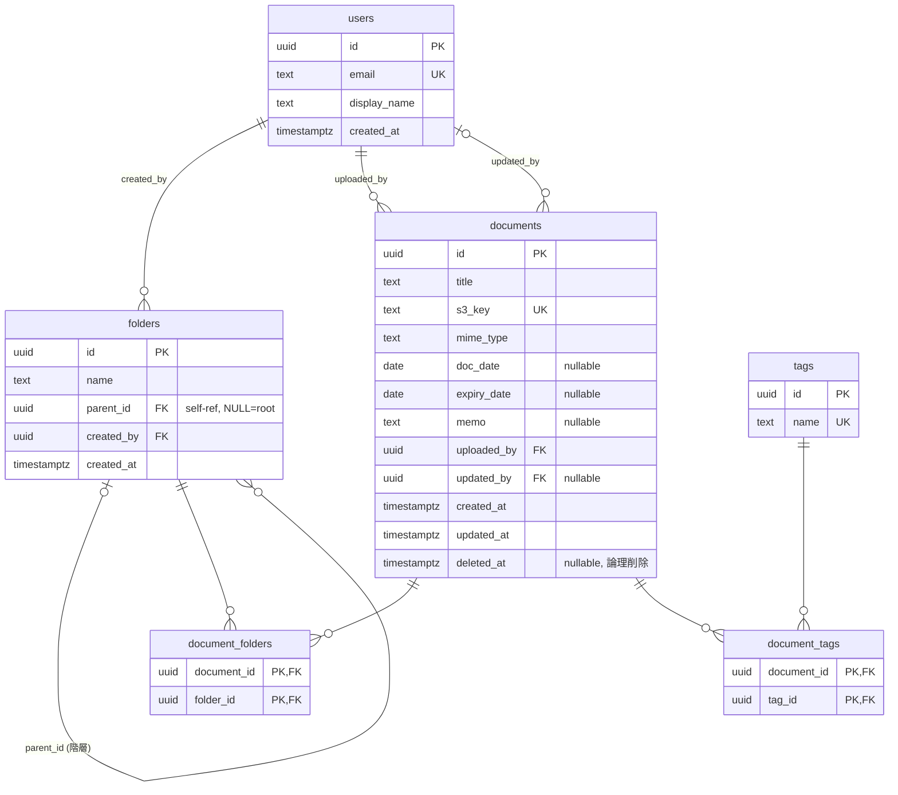

# ER 図

第1フェーズのテーブル関係。フォルダとタグは書類と多対多、フォルダは自己参照で階層を持つ。

## 関係の要点

- **users → folders / documents**: 作成者・アップロード者・更新者を参照。`updated_by` は NULL 可（更新されるまで NULL）。
- **folders → folders（自己参照）**: `parent_id` で階層。`NULL` はトップ階層。循環参照はアプリ側で防止（[invariants.md](./invariants.md)）。
- **documents ⇄ folders（多対多）**: `document_folders` が「1 書類を複数フォルダに入れる」実体。ファイラーの「🗂 2」バッジはこの行数。
- **documents ⇄ tags（多対多）**: `document_tags`。タグは書類の作成/更新時に名前で upsert。
- 中間表（`document_folders` / `document_tags`）は複合主キーで重複所属を防止し、`documents` / `folders` / `tags` 削除時に `ON DELETE CASCADE` で自動的に外れる。
